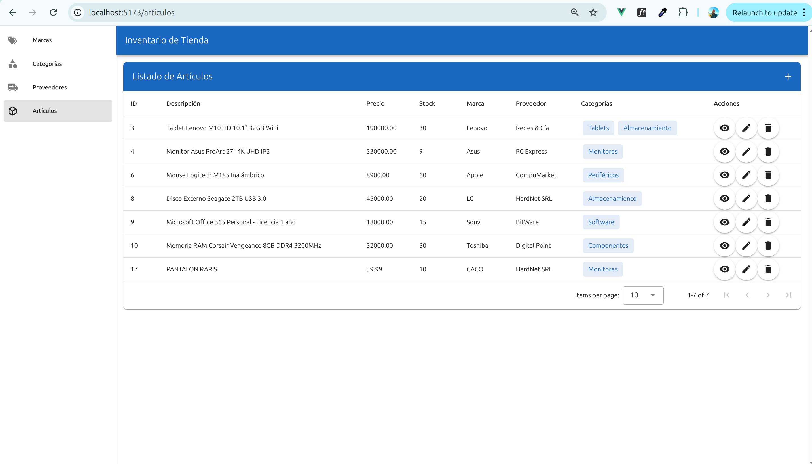

# 🚀 Set Up del Proyecto

Este proyecto utiliza **Flask** como framework web y una capa personalizada de acceso a base de datos Relacional SQL (`ConnectDB`) sin ORM.

---

## :memo: Requisitos Previos

- Python >= 3.10
- pip
- MySQL
- Entorno virtual

---

## :wrench: Instalación

### BACKEND

1. Cambia de directorio 
    ```bash
        cd backend 
    ```

2. **Crear Entorno Virtual E Ingresar Dentro**

    ```bash
        # Considerar la version: python3.10 -m venv venv
        python -m venv venv
        source venv/bin/activate   
    ```

3. **Instalar Dependencias**

    ```bash
        pip install -r requirements.txt
    ```

4. **Instalar Flask-CORS**

    ```bash
        pip install flask-cors
    ```

5. **Crear Archivo de Variables de Entorno**
    ```bash
        cp .env-dev .env
    ```

    Ejemplo:

    ```bash
        DB_NAME=tp_6_db
        DB_USER=root
        DB_PASSWORD=password 
        DB_HOST=localhost
        DB_PORT=3306
        FLASK_APP=app.py
        FLASK_ENV=development
    ```

6. **Correr la migracion de la DB**
    ```bash
        python db_init.py
    ```

7. **Correr flask**
    ```bash
        flask run
    ```

### FRONTEND

Requisitos
---
### :memo: Requisitos Previos

- NodeJS >= v18
---


1. Cambia de directorio 
    ```bash
        cd frontend 
    ```

2. Instalar dependencias
    ```bash
        npm install 
    ```

3. Despliegue en local 
    ```bash
        npm run dev 
            ```

## :camera: Captura del Proyecto

